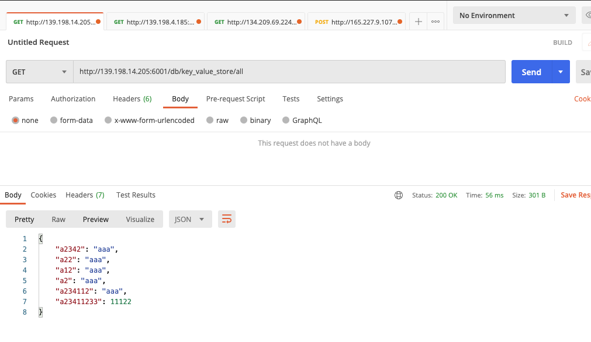
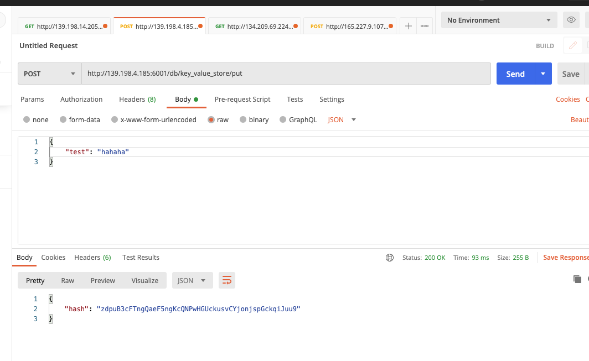

# OrbitDB HTTP API Server
[Original doc](https://github.com/orbitdb/orbit-db-http-api/blob/develop/README.md)

API please follow the origin doc above.

### Deplay list (test-net)
- http://139.198.14.205:6001 (china testnet-alice)
- http://139.198.4.185:6001 (china testnet-bob)
- http://134.209.69.224:6001 (us epoch)
- http://165.227.9.107:6001 (us indexer)

### Test sample
Use postman to send the http request.

- Query data


- Put data


PS: ```key_value_store``` is keyvalue type db.


